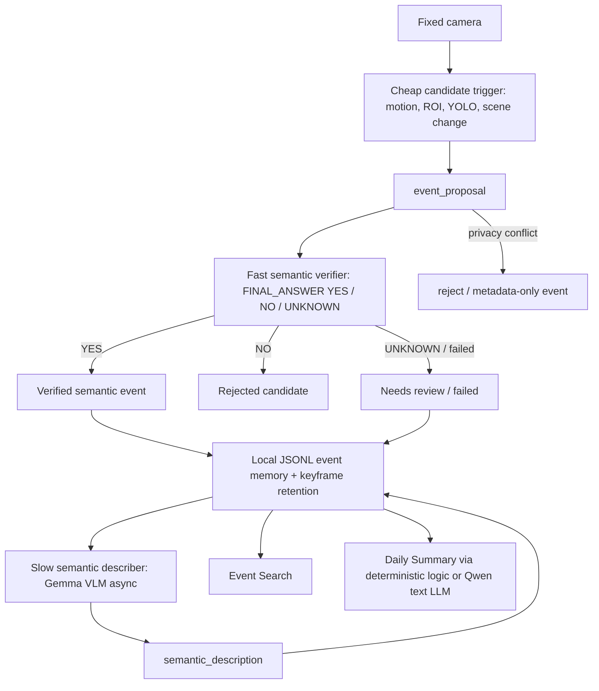

# EdgeLog

**Local-first semantic event memory for video.**

EdgeLog does not save all-day video and does not treat object detections as the product result. It uses cheap local visual signals to propose candidate events, uses a fast VLM-style verifier to decide whether a candidate matches a user-defined semantic rule, then stores searchable event memory and daily summaries.

Plain-language summary: EdgeLog turns a fixed camera feed into searchable semantic event memory. Jetson proposes candidate events locally. A VLM verifies whether those candidates are events the user cares about. Stronger VLM/LLM backends add descriptions and summaries later, so the user does not need to scrub through long video.

The gateway is infrastructure. The product loop is:

```text
cheap trigger -> event proposal -> fast VLM verifier -> semantic event -> slow description/search/daily summary
```

## Architecture



## EdgeLog v1 MVP

Single camera, fixed scene, semantic event memory:

| Layer | Responsibility | Current implementation |
| --- | --- | --- |
| Cheap Candidate Trigger | Quickly detect that something might have happened | YOLO labels, person/ROI overlap, object signature change, scene-change-ready schema |
| Fast Semantic Verifier | Decide whether a candidate matches the user's event rule | RTX SmolVLM2-256M service with FINAL_ANSWER protocol; mock remains available offline |
| Slow Semantic Describer | Add natural-language descriptions for confirmed/high-value events | Gemma remote VLM async path |
| Daily Summary | Summarize structured event records, not video | deterministic summary plus optional Qwen text LLM narrative |

Not in v1: face recognition, identity ("who"), multi-camera, real-time VLM, complex behavior recognition, cloud upload, or production video management.

## Why Not An Object Detection Log?

Users do not review video because they care that a detector saw `chair` or `bottle`. They care whether something meaningful happened:

- someone entered a restricted zone;
- someone approached a dangerous area;
- equipment was removed from a desk;
- a cabinet or door was left open;
- someone lingered too long;
- today's events need review.

YOLO TensorRT remains valuable because it is fast and local, but it is only a cheap trigger. VLM verification is the semantic decision layer.

## Key Technical Results

| Area | Result |
| --- | --- |
| Cheap trigger path | YOLOv8n TensorRT FP16 averages about 14.54 ms inference on Jetson benchmark evidence. |
| Fast verifier | SmolVLM2-256M is connected as an RTX FINAL_ANSWER verifier; validation passed YES / NO / UNKNOWN and graceful fallback cases. |
| Jetson local sentinel | SmolVLM2-256M runs on Jetson Orin Nano as a low-frequency async sentinel: 10/10 success, 946.24 ms average, 1675.01 ms P95, 100% final-line parse success, 855.06 MB peak CUDA memory. Not a per-frame VLM. |
| Slow describer | Gemma 4 E2B-it Q4 + mmproj is real, not mock, and is reserved for async event descriptions. |
| Text summary backend | Qwen text LLMs handle daily summary and search assistant roles. |
| Camera integration | CSI IMX219 + GStreamer Argus capture is validated. Snapshot capture can be around 1s; YOLO inference is much faster. |
| Retention | `runtime_data/` stores bounded JSONL history and event images; ordinary frames are not retained forever. |

## Demo

Start the interactive stack from the WSL repo root:

```bash
python3 demo/run_interactive_stack.py
python3 demo/check_interactive_stack.py
streamlit run demo/app.py
```

The Streamlit UI defaults to the Jetson Gateway at `http://192.168.1.102:8000`. Override with:

```bash
EDGE_GATEWAY_URL=http://custom-jetson:8000 streamlit run demo/app.py
```

Main pages:

- **Live Event Stream**: cheap triggers create proposals and the verifier promotes, rejects, or marks them unknown.
- **Event Rules**: define the user-facing semantic rule and verifier backend.
- **Event Search**: search verified/unknown/rejected semantic events.
- **Daily Summary**: summarize structured event records and completed descriptions.
- **System Status**: Jetson Gateway, local CV/LLM, RTX LLM/VLM readiness.
- **Model / Routing Policy**: why YOLO is a trigger, SmolVLM2 is a verifier candidate, Gemma is a slow describer, and Qwen is a summary assistant.

## Validation

EdgeLog validation artifacts:

- [docs/edgelog_product_spec.md](docs/edgelog_product_spec.md)
- [docs/edgelog_v1_validation.md](docs/edgelog_v1_validation.md)
- [docs/edgelog_real_mode_validation.md](docs/edgelog_real_mode_validation.md)
- [docs/semantic_event_memory_design.md](docs/semantic_event_memory_design.md)
- [docs/semantic_event_memory_validation.md](docs/semantic_event_memory_validation.md)
- [serving/results/raw/edgelog_v1_validation.csv](serving/results/raw/edgelog_v1_validation.csv)
- [serving/results/raw/edgelog_real_mode_validation.csv](serving/results/raw/edgelog_real_mode_validation.csv)
- [serving/results/raw/semantic_event_memory_validation.csv](serving/results/raw/semantic_event_memory_validation.csv)

Validation covers proposal creation, verifier YES/NO/UNKNOWN/failure, duplicate proposal suppression, search, daily summary exclusion of rejected candidates, retention, and system status expectations. The live SmolVLM2 verifier validation is tracked separately in `docs/smolvlm2_fast_verifier_integration.md`.

Latest real-mode stack validation passed Jetson camera YOLO (`15.22 ms` local inference), RTX SmolVLM2 verification (`267.15 ms` in the workflow case), RTX Gemma description (`16322.17 ms`, async-only), and RTX text summary (`538.9 ms`) through the EdgeLog gateway path. Separate Jetson feasibility testing shows SmolVLM2-256M can run locally as a low-frequency semantic sentinel, with `946.24 ms` average latency and `1675.01 ms` P95.

## Documentation Map

Product docs:

- [docs/semantic_event_memory_design.md](docs/semantic_event_memory_design.md)
- [docs/semantic_event_memory_validation.md](docs/semantic_event_memory_validation.md)
- [docs/smolvlm2_fast_verifier_integration.md](docs/smolvlm2_fast_verifier_integration.md)
- [docs/jetson_smolvlm2_feasibility.md](docs/jetson_smolvlm2_feasibility.md)
- [docs/edgelog_product_spec.md](docs/edgelog_product_spec.md)
- [docs/edgelog_v1_validation.md](docs/edgelog_v1_validation.md)
- [docs/edgelog_real_mode_validation.md](docs/edgelog_real_mode_validation.md)
- [demo/README.md](demo/README.md)
- [serving/docs/interactive_gateway_demo.md](serving/docs/interactive_gateway_demo.md)
- [docs/storage_retention_policy.md](docs/storage_retention_policy.md)

Technical appendix:

- [docs/quantization_decision_study.md](docs/quantization_decision_study.md)
- [docs/model_selection_scorecard.md](docs/model_selection_scorecard.md)
- [serving/docs/project3_tensorrt_report.md](serving/docs/project3_tensorrt_report.md)
- [serving/docs/reliability_report.md](serving/docs/reliability_report.md)
- [serving/docs/fast_vlm_verifier_benchmark.md](serving/docs/fast_vlm_verifier_benchmark.md)
- [serving/docs/vlm_output_robustness.md](serving/docs/vlm_output_robustness.md)
- [serving/docs/yolo_world_trigger_benchmark.md](serving/docs/yolo_world_trigger_benchmark.md)
- [serving/docs/remote_vlm_latency_optimization.md](serving/docs/remote_vlm_latency_optimization.md)
- [serving/docs/serving_design.md](serving/docs/serving_design.md)
- [serving/docs/routing_policy.md](serving/docs/routing_policy.md)

## Runtime Assets

These are intentionally not committed:

- GGUF models
- ONNX models
- TensorRT engines
- calibration images/caches
- runtime logs
- `runtime_data/` event history and private camera frames
- tokens, `.env`, SSH keys

## Limitations

- Prototype, not production serving.
- Single camera and fixed scene only.
- RTX SmolVLM2 remains the preferred higher-throughput verifier; Jetson SmolVLM2 is feasible only as a low-frequency async sentinel.
- Gemma VLM is asynchronous and slow; it is not a real-time detector.
- Event clips are schema-ready via `clip_path`, but v1 keeps keyframes as the stable path.
- Search is local JSONL keyword/filter search, not SQLite FTS5 or embeddings yet.
- No face recognition, identity tracking, cloud upload, Kubernetes, autoscaling, or production observability stack.

## Next Steps

- Broaden SmolVLM2 verifier validation to more user-defined event rules.
- Lightweight clip ring buffer with pre/post event seconds.
- SQLite FTS5 search, then optional embedding/FAISS retrieval.
- Persistent remote VLM server to reduce subprocess latency.
- Optional YOLO-World custom-object trigger path after controlled Jetson runtime validation.
