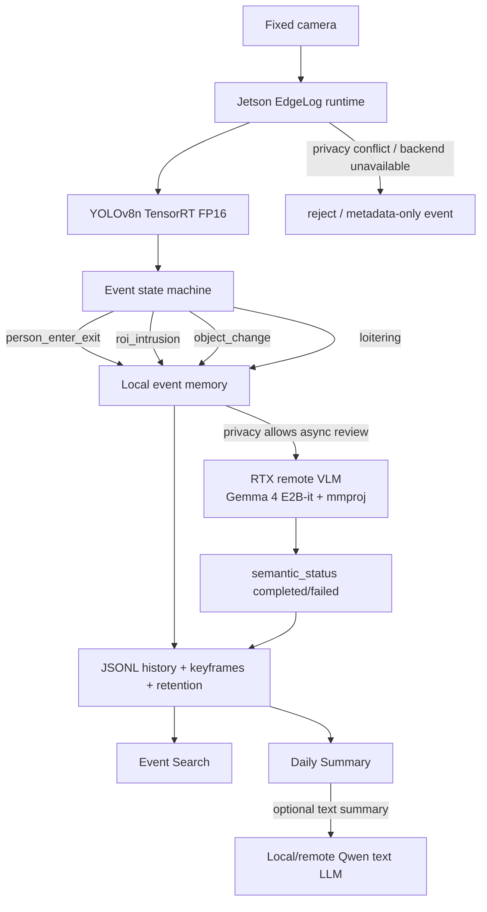

# EdgeLog

**Local-first video event memory box for semantic search and daily summaries.**

EdgeLog turns a fixed camera stream into searchable, summarizable local event memory. Jetson runs the real-time path: camera snapshot, YOLO TensorRT detection, simple event state, keyframe retention. RTX backends run the async semantic path: event review, semantic descriptions, and daily summaries only after an event exists and privacy allows offload.

In Chinese: EdgeLog 把固定摄像头的视频流转化为可搜索、可总结的本地事件记忆：Jetson 负责实时检测和事件切片，RTX 负责异步语义理解和日报生成，用户可以用自然语言检索历史事件，而不需要人工翻看长视频。

EdgeLog is not a generic AI gateway demo and not a full security platform. The gateway is infrastructure. The product is the event memory loop:

```text
camera frame -> Jetson YOLO/rules -> event + keyframe -> async RTX semantics -> search + daily summary
```

## Architecture



## EdgeLog v1 MVP

Single camera, fixed scene, local-first event memory:

| Event type | v1 trigger | Notes |
| --- | --- | --- |
| `person_enter_exit` | YOLO `person` appears or disappears | Uses state, not per-frame spam. |
| `roi_intrusion` | `person` enters a configured ROI | Records ROI name and triggering object. |
| `object_change` | ROI object signature changes | MVP uses keyframe difference + YOLO labels + simple rules. |
| `loitering` | `person` remains in ROI beyond threshold | Default threshold is configurable, e.g. 10 seconds. |

Not in v1: face recognition, identity ("who"), multi-camera, real-time VLM, complex behavior recognition, cloud upload, or production-scale video management.

## Why Event Memory Instead Of All-Day Recording?

All-day video is expensive to review and hard to search. EdgeLog keeps ordinary frames ephemeral, retains only meaningful events, and stores structured metadata plus keyframes. Remote semantic review is asynchronous because the Gemma VLM path can take roughly 15-30 seconds; that is acceptable for event annotation, but not for real-time triggering.

## Key Technical Results

| Area | Result |
| --- | --- |
| Jetson text backend | Qwen3.5 0.8B Q4_K_M selected as local default from quantization scorecard. |
| RTX text fallback | Qwen3.5 4B Q4_K_M handles heavier summaries/reasoning. |
| Local CV fast path | YOLOv8n TensorRT FP16 averages about 14.54 ms inference on Jetson benchmark evidence. |
| Camera integration | CSI IMX219 + GStreamer Argus capture is validated. Snapshot capture can be around 1s; YOLO inference is much faster. |
| Remote VLM | Gemma 4 E2B-it Q4 + mmproj is real, not mock, and is used only for async semantic event review. |
| Reliability | v0.7 minimal benchmark covers queue/fallback/reject/backend unavailable/timeout behavior. |
| Retention | `runtime_data/` stores bounded JSONL history and event images; ordinary frames are not retained forever. |

## Demo

Start the interactive stack from the WSL repo root:

```bash
python3 demo/run_interactive_stack.py
python3 demo/check_interactive_stack.py
streamlit run demo/app.py
```

The Streamlit UI defaults to the Jetson Gateway at `http://192.168.1.102:8000`. Override with:

```bash
EDGE_GATEWAY_URL=http://custom-jetson:8000 streamlit run demo/app.py
```

Main pages:

- **Live Event Stream**: capture once or start a snapshot loop; Jetson YOLO/rules create events.
- **Event Search**: local keyword/filter search over event type, objects, ROI, risk, and semantic description.
- **Daily Summary**: deterministic event counts/timeline, with optional LLM narrative summary.
- **System Status**: Jetson Gateway, local CV/LLM, RTX LLM/VLM readiness.
- **Model / Routing Policy**: why Jetson is the fast path and RTX is the async semantic path.

## Validation

EdgeLog v1 validation artifacts:

- [docs/edgelog_product_spec.md](docs/edgelog_product_spec.md)
- [docs/edgelog_v1_validation.md](docs/edgelog_v1_validation.md)
- [serving/results/raw/edgelog_v1_validation.csv](serving/results/raw/edgelog_v1_validation.csv)

Validation covers person enter, ROI intrusion, object change, loitering, cooldown de-duplication, search, daily summary, async semantic status update, retention, and system status expectations. Some event-state tests are simulated because they validate state-machine behavior rather than production video.

## Documentation Map

Product docs:

- [docs/edgelog_product_spec.md](docs/edgelog_product_spec.md)
- [docs/edgelog_v1_validation.md](docs/edgelog_v1_validation.md)
- [demo/README.md](demo/README.md)
- [serving/docs/interactive_gateway_demo.md](serving/docs/interactive_gateway_demo.md)
- [docs/storage_retention_policy.md](docs/storage_retention_policy.md)

Technical appendix:

- [docs/quantization_decision_study.md](docs/quantization_decision_study.md)
- [docs/model_selection_scorecard.md](docs/model_selection_scorecard.md)
- [serving/docs/project3_tensorrt_report.md](serving/docs/project3_tensorrt_report.md)
- [serving/docs/reliability_report.md](serving/docs/reliability_report.md)
- [serving/docs/remote_vlm_latency_optimization.md](serving/docs/remote_vlm_latency_optimization.md)
- [serving/docs/fast_vlm_verifier_benchmark.md](serving/docs/fast_vlm_verifier_benchmark.md)
- [serving/docs/vlm_output_robustness.md](serving/docs/vlm_output_robustness.md)
- [serving/docs/yolo_world_trigger_benchmark.md](serving/docs/yolo_world_trigger_benchmark.md)
- [serving/docs/serving_design.md](serving/docs/serving_design.md)
- [serving/docs/routing_policy.md](serving/docs/routing_policy.md)

## Runtime Assets

These are intentionally not committed:

- GGUF models
- ONNX models
- TensorRT engines
- calibration images/caches
- runtime logs
- `runtime_data/` event history and private camera frames
- tokens, `.env`, SSH keys

## Limitations

- Prototype, not production serving.
- Single camera and fixed scene only.
- Event clips are schema-ready via `clip_path`, but v1 keeps keyframes as the stable path; clip ring buffer is a next step.
- Search is local JSONL keyword/filter search, not SQLite FTS5 or embeddings yet.
- Remote VLM is asynchronous and slow; it is not a real-time detector.
- No face recognition, identity tracking, cloud upload, Kubernetes, autoscaling, or production observability stack.

## Next Steps

- Lightweight clip ring buffer with pre/post event seconds.
- SQLite FTS5 search, then optional embedding/FAISS retrieval.
- Persistent remote VLM server to reduce subprocess latency.
- Optional YOLO-World custom-object trigger path after controlled Jetson runtime validation.
- Recorded walkthrough and submission packaging.
