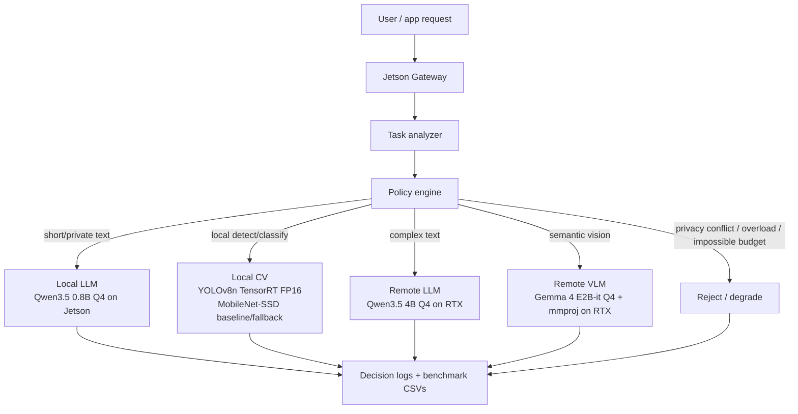

# Jetson Local-First Monitoring Gateway

**Constraint-aware routing across local LLM/CV and remote LLM/VLM backends.**

This project is a Jetson-first edge AI inference gateway, not a single-model demo. It turns benchmark results into a local-first monitoring workbench: Jetson handles low-latency local detection and private tasks, while RTX backends are used for event review, summaries, and heavier semantic reasoning only when privacy and system constraints allow. The monitoring path is event-triggered: YOLO TensorRT runs locally on snapshots, and VLM review is queued only for candidate events.

## What This Project Is

- **Project 1:** quantized LLM deployment decision study for Jetson and RTX.
- **Project 2:** explainable task router across Jetson local LLM and RTX remote LLM.
- **Project 2 v0.5:** camera-aware router with CSI camera, local CV, and remote VLM.
- **Project 3:** local CV runtime optimization with ONNXRuntime, TensorRT FP16, INT8 calibration, and a C++ worker benchmark.
- **v0.6/v0.7:** optimized YOLO TensorRT backend integrated into the vision router, then checked with a small reliability benchmark.
- **v0.9 Monitoring Workbench:** Streamlit UI for Live Monitor, Event Review, Monitoring Assistant, Event History, System Status, and Model Policy.
- **Remote VLM profiling:** latency breakdown and low-risk resize/prompt defaults for the Gemma VLM path.

Model responsibilities are intentionally separated:

- **Qwen text LLM:** Monitoring Assistant local/remote text backend.
- **MobileNet-SSD:** v0.5 camera/CV system integration baseline.
- **YOLOv8n TensorRT:** optimized local monitoring fast path.
- **Gemma 4 VLM:** remote semantic event review backend.

## Architecture



## Key Results

### 1. LLM Quantization Decision

Jetson Orin Nano 8GB results for the same Qwen3.5 0.8B PTQ model:

| Quant | Decode tok/s | Peak memory MB | Decode tok/s/W | Decision |
|---|---:|---:|---:|---|
| F16 | 24.98 | 3677 | 1.32 | Reference only; too slow/heavy for default |
| Q8_0 | 47.10 | 2953 | 2.39 | Conservative fallback when quality margin matters |
| Q4_K_M | 56.54 | 2703 | 2.80 | Default Jetson local text backend |

Source: [docs/quantization_decision_study.md](docs/quantization_decision_study.md)

### 2. Model / Backend Scorecard Recommendations

| Profile | Recommended backend | Why |
|---|---|---|
| `text_local_default` | Qwen3.5 0.8B `Q4_K_M` on Jetson | Best local text latency, memory, and tok/s/W balance |
| `text_quality_fallback` | Qwen3.5 4B `Q4_K_M` on RTX | Stronger text model for quality-oriented tasks |
| `vision_local_fast_path` | YOLOv8n TensorRT FP16 on Jetson | Fastest measured local CV runtime |
| `vision_remote_semantic_backend` | Gemma 4 E2B-it `Q4_K_M` + `mmproj-F16` on RTX | Real remote VLM for VQA / scene description |

Source: [docs/model_selection_scorecard.md](docs/model_selection_scorecard.md)

### 3. Local CV Optimization

| Runtime | Model | Avg inference ms | P95 ms | Avg total ms | Note |
|---|---|---:|---:|---:|---|
| OpenCV DNN | MobileNet-SSD | 90.71 | 95.87 | 127.83 | v0.5 integration baseline |
| ONNXRuntime old | SSD-MobileNetV1 | 53.23 | 60.92 | 4929.98 | Session recreated per request |
| ONNXRuntime reuse | SSD-MobileNetV1 | 42.02 | 41.67 | 49.04 | Session reuse removes adapter overhead |
| YOLO ONNXRuntime reuse | YOLOv8n | 91.70 | 107.10 | 108.64 | TensorRT comparison baseline |
| YOLO TensorRT FP16 | YOLOv8n | 14.54 | 14.71 | 28.98 | Optimized local CV fast path |
| YOLO TensorRT INT8 | YOLOv8n | 11.60 | 11.93 | 27.64 | Faster and smaller, but current calibration drifts to `no_detection` |
| YOLO TensorRT C++ worker | YOLOv8n FP16 | 14.07 | 14.18 | 29.29 | Optional mixed Python/C++ hot-path benchmark |

Source: [serving/docs/project3_tensorrt_report.md](serving/docs/project3_tensorrt_report.md)

### 4. Routing / Reliability Demos

| Demo | What it proves | Result |
|---|---|---|
| v0.3 text LLM local/remote | Jetson local 0.8B Q4 + RTX remote 4B Q4 both real | 11/11 expected routes |
| v0.5a camera + local CV | CSI camera + MobileNet-SSD local detection path | 10/10 expected routes |
| v0.5b real remote VLM | Gemma 4 multimodal backend is real, not mock | 10/10 routes, `remote_is_mock=false` |
| v0.6 YOLO TensorRT router | Optimized local CV backend is used by router | 10/10 routes, `fallback_used=false` |
| v0.7 reliability benchmark | Queue/fallback/reject/timeout behavior is explainable | 80 benchmark requests, pass rate 1.0 at concurrency 1/2/4/8; 9/9 failure modes |
| v0.8 remote VLM profiling | Gemma VLM subprocess latency is measured and reduced with resize/prompt defaults | About 19.0 s baseline to about 16.7-17.2 s recommended config |
| Fast VLM verifier benchmark | Compact SmolVLM2 models are tested as faster event-level semantic verifiers | Sub-second RTX latency, but 0/36 valid JSON responses, so not a drop-in structured verifier |
| v0.9 Monitoring Workbench | Browser UI productizes the gateway into Live Monitor, Event Review, Monitoring Assistant, Event History, System Status, and Model Policy | Real mode calls Jetson Gateway; JSONL history records detections, reviews, rejects, assistant summaries, and event-triggered VLM review status |

Source: [serving/docs/reliability_report.md](serving/docs/reliability_report.md)

## Model / Backend Selection Scorecard

The scorecard makes deployment preferences explicit instead of relying on subjective model choice. It combines hard constraints with profile-specific weights for performance, quality, memory, power, stability, integration status, and size.

Run:

```bash
python3 scripts/score_model_candidates.py \
  --candidates results/raw/model_selection_candidates.csv \
  --profiles configs/model_selection_profiles.yaml \
  --out results/raw/model_selection_scores.csv
```

Artifacts:

- [configs/model_selection_profiles.yaml](configs/model_selection_profiles.yaml)
- [results/raw/model_selection_candidates.csv](results/raw/model_selection_candidates.csv)
- [results/raw/model_selection_scores.csv](results/raw/model_selection_scores.csv)
- [docs/model_selection_scorecard.md](docs/model_selection_scorecard.md)

## Project Evolution

1. **Quantization decision study:** Qwen3.5 0.8B Q4 becomes the Jetson default because Q4 gives similar power draw but much higher useful throughput per watt than F16.
2. **Text router:** local text tasks run on Jetson; code/reasoning/high-quality text can route to RTX.
3. **Camera-aware router:** Jetson captures CSI frames, handles simple local CV, and routes semantic vision to a remote VLM when privacy allows.
4. **Local CV optimization:** MobileNet-SSD proves the integration path; YOLOv8n TensorRT becomes the optimized local CV backend.
5. **Reliability benchmark:** v0.7 checks queue pressure, fallback, reject, backend unavailable, privacy, and timeout behavior.
6. **Monitoring Workbench:** v0.9 productizes the real gateway as a local-first monitoring flow without bypassing the router.

## How To Reproduce Main Demos

Main entry points:

- LLM quantization decision: [docs/quantization_decision_study.md](docs/quantization_decision_study.md)
- Scorecard: `python3 scripts/score_model_candidates.py ...`
- Text router smoke: `python3 serving/scripts/smoke_dual_real_backends.py --url http://127.0.0.1:8000`
- Vision router smoke: `python3 serving/scripts/smoke_vision_router.py`
- Real remote VLM smoke: `python3 serving/scripts/smoke_vision_router_real_vlm.py --remote-url http://127.0.0.1:18091`
- YOLO TensorRT router smoke: `python3 serving/scripts/smoke_vision_router_yolo_trt.py`
- Reliability benchmark: `python3 serving/scripts/reliability_benchmark.py --mode vision --concurrency 1,2,4,8 --requests 20`
- Fast VLM verifier benchmark: `python3 serving/scripts/benchmark_fast_vlm_verifiers.py --models smolvlm2_500m,smolvlm2_256m,smolvlm2_2b,fastvlm_05b`
- Interactive demo stack: `python3 demo/run_interactive_stack.py`, then `python3 demo/check_interactive_stack.py`
- Monitoring Workbench: `streamlit run demo/app.py` or `python3 demo/run_interactive_stack.py --with-ui`
- Monitoring Workbench real-mode validation: [docs/monitoring_workbench_real_mode_validation.md](docs/monitoring_workbench_real_mode_validation.md)
- Event-triggered monitoring validation: [docs/monitoring_workbench_event_trigger_validation.md](docs/monitoring_workbench_event_trigger_validation.md)
- Monitoring storage retention policy: [docs/storage_retention_policy.md](docs/storage_retention_policy.md)
- Interactive gateway smoke: `python3 serving/scripts/smoke_interactive_gateway.py --url http://127.0.0.1:8000`
- Interactive demo notes: [serving/docs/interactive_gateway_demo.md](serving/docs/interactive_gateway_demo.md)
- Setup notes: [docs/setup_requirements.md](docs/setup_requirements.md)

Runtime assets are intentionally outside git:

- `llama.cpp/`
- GGUF models
- ONNX models
- TensorRT engines
- calibration images/caches
- runtime workbench history under `runtime_data/`

The workbench does not retain every auto-refresh frame. Ordinary frames overwrite the latest snapshot, while alerts, trigger matches, reviews, rejects, backend errors/fallbacks, assistant summaries, and user-saved events follow the retention policy documented in [docs/storage_retention_policy.md](docs/storage_retention_policy.md). The UI separates capture latency from YOLO TensorRT inference latency because snapshot camera acquisition can dominate the end-to-end path.

## Sharing Note

If this repository stays private, public viewers will see a GitHub `404`. Before using a GitHub link in a resume or application, either make the repo public, add the reviewer as a collaborator, or share an exported README/report/demo artifact. See [docs/submission_checklist.md](docs/submission_checklist.md).

## Documentation Map

- [docs/model_selection_scorecard.md](docs/model_selection_scorecard.md)
- [docs/quantization_decision_study.md](docs/quantization_decision_study.md)
- [docs/setup_requirements.md](docs/setup_requirements.md)
- [docs/submission_checklist.md](docs/submission_checklist.md)
- [docs/monitoring_workbench_real_mode_validation.md](docs/monitoring_workbench_real_mode_validation.md)
- [docs/monitoring_workbench_event_trigger_validation.md](docs/monitoring_workbench_event_trigger_validation.md)
- [docs/storage_retention_policy.md](docs/storage_retention_policy.md)
- [serving/docs/vision_routing_design.md](serving/docs/vision_routing_design.md)
- [serving/docs/project3_tensorrt_report.md](serving/docs/project3_tensorrt_report.md)
- [serving/docs/cpp_tensorrt_adapter.md](serving/docs/cpp_tensorrt_adapter.md)
- [serving/docs/remote_vlm_latency_optimization.md](serving/docs/remote_vlm_latency_optimization.md)
- [serving/docs/fast_vlm_verifier_benchmark.md](serving/docs/fast_vlm_verifier_benchmark.md)
- [serving/docs/interactive_gateway_demo.md](serving/docs/interactive_gateway_demo.md)
- [serving/docs/reliability_report.md](serving/docs/reliability_report.md)
- [serving/docs/serving_design.md](serving/docs/serving_design.md)
- [serving/docs/routing_policy.md](serving/docs/routing_policy.md)

## Limitations

- Prototype, not production serving.
- v0.7 reliability uses in-process queue state, not a distributed queue.
- Remote VLM latency is still high because the current wrapper uses subprocess CLI serving.
- Model weights and TensorRT engines are not included in git.
- Quality scores are partly manual / heuristic.
- No Kubernetes, autoscaling, or production observability stack.
- Runtime monitoring history is local JSONL with bounded retention, not a production audit database.
- INT8 calibration has been benchmarked, but it is not the router default because the current calibration set causes detection drift.
- C++ hot-path worker is benchmarked but not yet connected as the router default.

## Next Steps

- Persistent remote VLM serving to replace subprocess CLI mode.
- Optional UI polish and recorded walkthrough for reviewer submissions.
