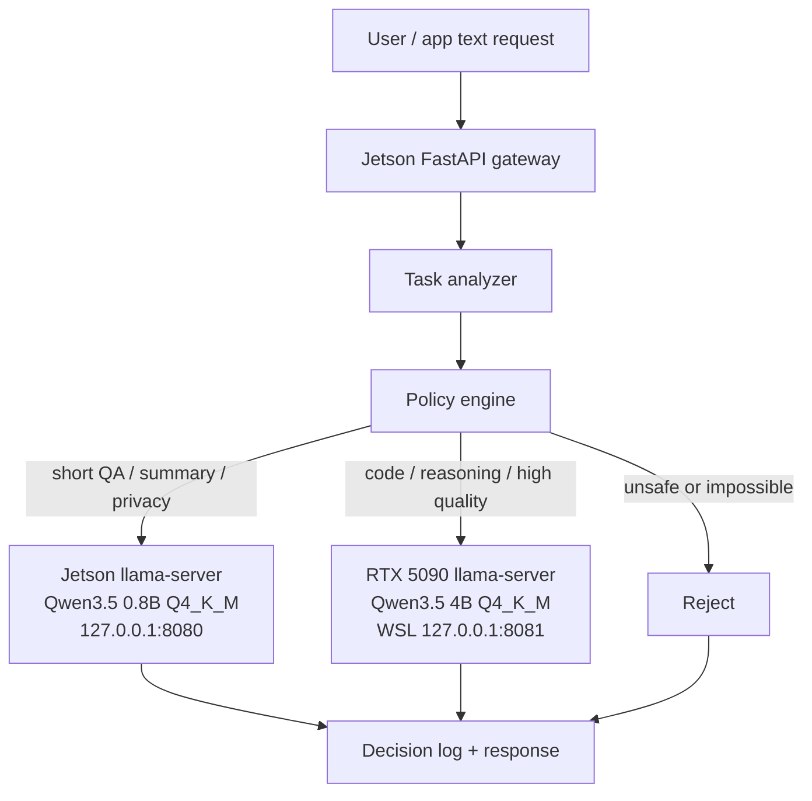

# Edge LLM Task Router MVP Design

## Purpose

Project 2 is not a generic serving demo. The MVP is a Jetson-first task router: the Jetson acts as the edge gateway, analyzes each text request, applies an explainable policy, and decides whether the task should run locally, be forwarded to an RTX 5090 backend, or be rejected/degraded.

The key output is not only a model response. The key output is a routing decision with reasons.

## System Shape

```text
User / App / Future Camera Input
        |
        v
Jetson Gateway (FastAPI)
        |
        v
Task Analyzer
        |
        v
Policy Engine
        |
        +--> Local Jetson Backend
        |
        +--> Remote RTX Backend
        |
        +--> Reject / Degrade
        |
        v
Decision Log + Metrics
```

The first MVP supports text requests only. Camera, VLM, TensorRT, vLLM, streaming, and real concurrent scheduling are intentionally out of scope.

## API Surface

- `GET /health`: gateway and backend availability.
- `GET /metrics`: simple aggregate routing metrics.
- `POST /v1/route`: route decision only; no model call required.
- `POST /v1/chat/completions`: minimal OpenAI-style chat subset, with non-streaming responses.

Every route response includes:

- `route`: `local`, `remote`, or `reject`
- `selected_model`
- `reasons`
- `estimated_risk`
- task analysis fields such as estimated prompt tokens

## Why Jetson Is The Gateway

Jetson is closest to the edge context: local device state, privacy constraints, thermal limits, and future camera or sensor inputs. That makes it a better gateway than the RTX workstation. The RTX backend is a powerful fallback, but it should not own the decision about whether data is allowed to leave the edge device.

This also mirrors realistic deployment: the edge node should make a quick local-vs-remote decision before spending network time or exposing private data.

## How Project 1 Supports The Policy

Project 1 provides the policy's engineering basis:

- **Qwen3.5 0.8B Q4_K_M** is the local default. On Jetson it reached 56.54 decode tok/s, 2703 MB peak memory, and 2.80 decode tok/s/W.
- **Qwen3.5 4B Q4_K_M** is feasible on Jetson as a quality-oriented candidate. The full 10-prompt representative run succeeded, but decode was 16.86 tok/s and peak memory was 4549 MB, so it should not replace the low-latency 0.8B default.
- **Gemma 4 E2B Q4** remains a medium non-Qwen candidate in policy documentation, but the MVP does not depend on it.
- **Q8_0 and F16** are useful references or conservative quality options, but they are not local defaults because they are larger and less efficient on Jetson.

## Backends

The MVP includes two backend implementations:

- `MockBackend`: default. It returns a deterministic text response including backend name, selected model, and a short prompt summary.
- `LlamaCppBackend`: optional. It calls a llama-server OpenAI-compatible endpoint such as `http://127.0.0.1:8080/v1/chat/completions`.

Default config uses mock mode so the router can be tested without starting llama-server.

## v0.2 Real Jetson Local Backend

v0.2 connects the local route to a real Jetson llama.cpp backend while keeping the remote route as a mock placeholder. The Jetson runs `llama-server` on Qwen3.5 0.8B Q4_K_M, the same Project 1 default chosen from the quantization decision study.

Runtime shape:

- local `llama-server`: `http://127.0.0.1:8080`
- gateway: `http://127.0.0.1:8000`
- router config: `serving/configs_llamacpp_local`
- `backend_mode`: `hybrid`
- local backend: `LlamaCppBackend`
- remote backend: `MockBackend`

This matters because the routing decision now controls an actual local inference path. Local `/v1/chat/completions` responses are real Qwen3.5 0.8B Q4 outputs instead of `[mock:local_mock]` text, and backend latency now includes real model inference time for local routes. Remote is still intentionally mocked until the RTX backend stage is started.

Smoke verification writes:

```text
serving/results/raw/real_local_backend_smoke.csv
```

The v0.2 smoke run uses 9 requests: 4 local, 4 remote, and 1 reject. The local requests must return non-mock text from `llama-server`; remote requests are expected to return `[mock:remote_mock]` until the RTX backend is connected.

## v0.3 Real RTX Remote Backend

v0.3 connects the remote route to a real RTX 5090 `llama-server` running Qwen3.5 4B Q4_K_M. The router now exercises the complete heterogeneous loop:



Runtime shape used for the smoke test:

- Jetson local backend: `http://127.0.0.1:8080`
- RTX remote backend: Qwen3.5 4B Q4_K_M on WSL, listening on `0.0.0.0:8081`
- Jetson remote access path: `http://127.0.0.1:18081` through an SSH reverse tunnel to RTX/WSL `127.0.0.1:8081`
- gateway config: `serving/configs_dual_llamacpp`
- `backend_mode`: `llamacpp`

The SSH reverse tunnel is a deployment workaround for the current Windows/WSL networking setup: the RTX server is reachable from Windows on `127.0.0.1:8081`, but the laptop LAN IP did not expose that WSL port to Jetson. The tunnel keeps the v0.3 router semantics intact: remote routes still execute on the RTX 5090 model, not on Jetson.

Smoke verification writes:

```text
serving/results/raw/dual_real_backend_smoke.csv
```

The v0.3 smoke run uses 11 requests: 4 local, 6 remote, and 1 reject. Both local and remote successful responses must be non-mock.

## Decision Logging

Each request appends a JSON line to:

```text
serving/results/raw/routing_decisions.jsonl
```

The log records timestamp, request id, task type, estimated tokens, quality, privacy, route, selected model, reasons, backend latency, total latency, and status.

## MVP Limitations

- Device state is mocked by default: local queue depth is `0` and Jetson temperature is a fixed healthy value.
- Quality classification is rule-based, not ML-based.
- The policy is intentionally simple and explainable.
- No streaming responses yet.
- No real concurrent queue or admission control.
- No TensorRT, vLLM, VLM, camera, or multimodal routing.
- The load test evaluates policy agreement, not model quality.

## Run Locally

```bash
cd /mnt/d/AI/edge-llm-bench
.venv/bin/python -m uvicorn serving.app.main:app --host 127.0.0.1 --port 8000
```

Then run:

```bash
.venv/bin/python serving/scripts/load_test_router.py --url http://127.0.0.1:8000
```

## Run On Jetson

```bash
cd /home/rainbow/edge-llm-bench
bash serving/scripts/run_gateway_jetson.sh
```

The default gateway still uses mock backend unless `serving/configs/policy.yaml` is changed to `backend_mode: llamacpp` and llama-server endpoints are running.

For v0.2 hybrid mode, start local llama-server first, then start the gateway with:

```bash
EDGE_ROUTER_CONFIG_DIR=/home/rainbow/edge-llm-bench/serving/configs_llamacpp_local \
python3 -m uvicorn serving.app.main:app --host 127.0.0.1 --port 8000
```

Then run:

```bash
python3 serving/scripts/smoke_real_local_backend.py --url http://127.0.0.1:8000
```

For v0.3 dual real backend mode, start the RTX remote server on the laptop/WSL side:

```bash
cd /mnt/d/AI/edge-llm-bench
HOST=0.0.0.0 PORT=8081 bash serving/scripts/run_remote_llama_server_5090.sh
```

If Jetson cannot reach the laptop LAN IP directly, create the reverse tunnel from WSL:

```bash
ssh -N -R 18081:127.0.0.1:8081 rainbow@192.168.1.102
```

Then start the Jetson gateway with:

```bash
EDGE_ROUTER_CONFIG_DIR=/home/rainbow/edge-llm-bench/serving/configs_dual_llamacpp \
python3 -m uvicorn serving.app.main:app --host 127.0.0.1 --port 8000

python3 serving/scripts/smoke_dual_real_backends.py --url http://127.0.0.1:8000
```
