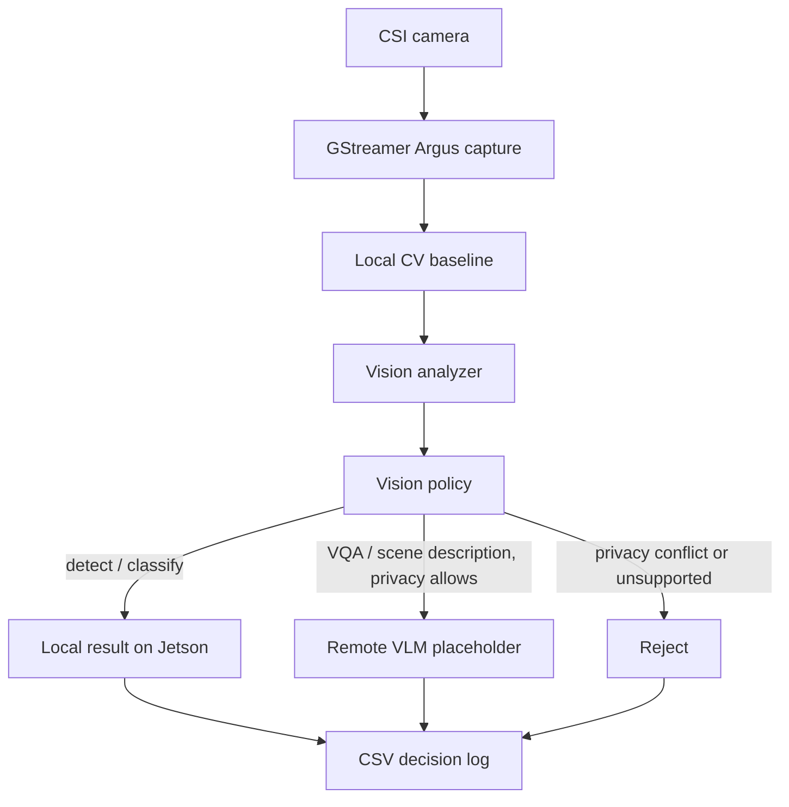

# Vision Routing Design

## Scope

v0.5a upgrades Project 2 from a text-only heterogeneous LLM router into a camera-aware edge AI router. It is still an MVP: camera capture and local CV are real, but remote VLM is a marked placeholder for v0.5b.

This stage does not add TensorRT, VLM weights, video streaming, multi-camera support, or camera input to the text LLM router.

## Why Add Camera Input

The Jetson is physically close to the sensor, so it is the right place to make the first decision about an image. Sending every frame to a remote workstation would waste network bandwidth, increase latency, and risk leaking private visual data. The edge node should first answer: can this be handled locally, should it go remote, or should it be rejected?

## Pipeline



## Camera Capture

The reusable capture module is `serving/app/camera.py`. It supports:

- Jetson CSI capture through `nvarguscamerasrc` and `nvvidconv`;
- regular V4L2 camera fallback for non-CSI devices;
- output image path supplied by the caller;
- metadata including backend, resolution, capture latency, device path, and available `/dev/video*` / `/dev/media*` nodes.

The validated Jetson camera path is:

- camera: IMX219 on CAM1
- Jetson-IO config: `Camera IMX219-C` on `Header 2: Jetson 24pin CSI Connector`
- device nodes: `/dev/video0`, `/dev/media0`
- capture backend: `GStreamer Argus`
- smoke resolution: `1280x720`

## Local CV Baseline

v0.5a uses MobileNet-SSD with OpenCV DNN:

- model: `mobilenet_ssd_voc_opencv_dnn`
- input size: `300x300`
- model files live outside git under `/home/rainbow/models/vision/mobilenet_ssd/`
- source model family: MobileNet-SSD Caffe model used by OpenCV DNN examples
- runtime: Python OpenCV DNN, no PyTorch, no TensorRT

This was chosen because it is small, easy to run on Jetson, and good enough to prove local CV routing. It is not the final accuracy target. The current smoke image did not contain a clear PASCAL VOC object, so the detector returned `no_detection`; that is acceptable for pipeline validation but future demos should include a simple VOC object such as `bottle`, `chair`, or `person`.

Jetson setup used for the smoke:

```bash
python3 -m pip install --user opencv-python-headless
mkdir -p /home/rainbow/models/vision/mobilenet_ssd
wget -O /home/rainbow/models/vision/mobilenet_ssd/deploy.prototxt \
  https://raw.githubusercontent.com/chuanqi305/MobileNet-SSD/master/deploy.prototxt
wget -O /home/rainbow/models/vision/mobilenet_ssd/mobilenet_iter_73000.caffemodel \
  https://raw.githubusercontent.com/chuanqi305/MobileNet-SSD/master/mobilenet_iter_73000.caffemodel
```

These files are runtime assets and must stay outside git.

## Routing Rules

The vision policy lives in `serving/app/vision_policy.py`.

Local route:

- `task_type=detect` or `classify`
- local CV is available
- `quality` is not `high`

Remote route:

- `privacy=allow_remote`
- `task_type=vqa` or `scene_description`
- or `quality=high`

Reject:

- `privacy=local_only` and the task needs high-level semantic visual reasoning
- unknown vision task type
- impossible latency budget for semantic vision work
- required backend unavailable

The remote route is intentionally marked `remote_is_mock=true` in v0.5a. Real remote VLM serving is deferred to v0.5b after a separate model selection and resource check.

## Smoke Result

Run on Jetson:

```bash
cd /home/rainbow/edge-llm-bench
python3 serving/scripts/smoke_vision_router.py
```

Outputs:

- `results/figures/camera_v05_sample.jpg`
- `serving/results/raw/local_cv_baseline.csv`
- `serving/results/raw/vision_router_smoke.csv`

Current result:

- cases: `10`
- route matches: `10/10`
- route distribution: local `4`, remote `4`, reject `2`
- capture backend: `GStreamer Argus`
- capture resolution: `1280x720`
- capture latency: about `1209 ms`
- local CV model: `mobilenet_ssd_voc_opencv_dnn`
- local CV inference latency: about `76.6 ms`
- detected labels: `no_detection`
- remote VLM: mock placeholder, explicitly marked in CSV

## v0.5a vs v0.5b

v0.5a proves the edge sensing and routing shape:

- real camera capture;
- real local CV;
- explainable visual routing;
- privacy-aware rejection;
- remote VLM placeholder.

v0.5b should connect a real remote VLM only after a separate decision on model choice, memory footprint, runtime, and image privacy policy. It should not be bundled with TensorRT work.
