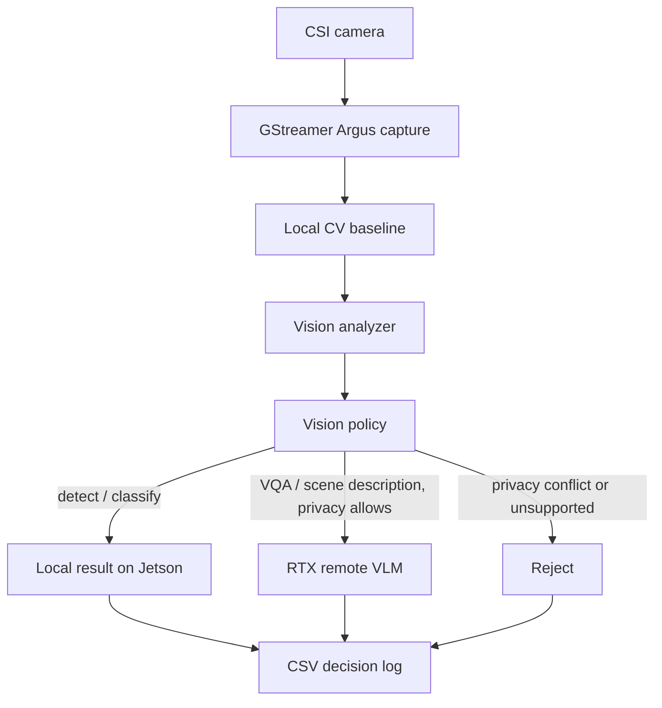

# Vision Routing Design

## Scope

v0.5a upgraded Project 2 from a text-only heterogeneous LLM router into a camera-aware edge AI router. Camera capture and local CV are real. v0.5b keeps that Jetson path and replaces the remote VLM placeholder with a real RTX/WSL VLM backend.

This stage does not add TensorRT, video streaming, multi-camera support, or camera input to the text LLM router.

## Why Add Camera Input

The Jetson is physically close to the sensor, so it is the right place to make the first decision about an image. Sending every frame to a remote workstation would waste network bandwidth, increase latency, and risk leaking private visual data. The edge node should first answer: can this be handled locally, should it go remote, or should it be rejected?

## Pipeline



## Camera Capture

The reusable capture module is `serving/app/camera.py`. It supports:

- Jetson CSI capture through `nvarguscamerasrc` and `nvvidconv`;
- regular V4L2 camera fallback for non-CSI devices;
- output image path supplied by the caller;
- metadata including backend, resolution, capture latency, device path, and available `/dev/video*` / `/dev/media*` nodes.

The validated Jetson camera path is:

- camera: IMX219 on CAM1
- Jetson-IO config: `Camera IMX219-C` on `Header 2: Jetson 24pin CSI Connector`
- device nodes: `/dev/video0`, `/dev/media0`
- capture backend: `GStreamer Argus`
- smoke resolution: `1280x720`

## Local CV Baseline

v0.5a uses MobileNet-SSD with OpenCV DNN:

- model: `mobilenet_ssd_voc_opencv_dnn`
- input size: `300x300`
- model files live outside git under `/home/rainbow/models/vision/mobilenet_ssd/`
- source model family: MobileNet-SSD Caffe model used by OpenCV DNN examples
- runtime: Python OpenCV DNN, no PyTorch, no TensorRT

This was chosen because it is small, easy to run on Jetson, and good enough to prove local CV routing. It is not the final accuracy target. The current smoke image did not contain a clear PASCAL VOC object, so the detector returned `no_detection`; that is acceptable for pipeline validation but future demos should include a simple VOC object such as `bottle`, `chair`, or `person`.

Jetson setup used for the smoke:

```bash
python3 -m pip install --user opencv-python-headless
mkdir -p /home/rainbow/models/vision/mobilenet_ssd
wget -O /home/rainbow/models/vision/mobilenet_ssd/deploy.prototxt \
  https://raw.githubusercontent.com/chuanqi305/MobileNet-SSD/master/deploy.prototxt
wget -O /home/rainbow/models/vision/mobilenet_ssd/mobilenet_iter_73000.caffemodel \
  https://raw.githubusercontent.com/chuanqi305/MobileNet-SSD/master/mobilenet_iter_73000.caffemodel
```

These files are runtime assets and must stay outside git.

## Routing Rules

The vision policy lives in `serving/app/vision_policy.py`.

Local route:

- `task_type=detect` or `classify`
- local CV is available
- `quality` is not `high`

Remote route:

- `privacy=allow_remote`
- `task_type=vqa` or `scene_description`
- or `quality=high`

Reject:

- `privacy=local_only` and the task needs high-level semantic visual reasoning
- unknown vision task type
- impossible latency budget for semantic vision work
- required backend unavailable

The remote route is intentionally marked `remote_is_mock=true` in v0.5a. In v0.5b, the same policy can call a real HTTP VLM backend and records `remote_is_mock=false` for successful remote rows.

## Smoke Result

Run on Jetson:

```bash
cd /home/rainbow/edge-llm-bench
python3 serving/scripts/smoke_vision_router.py
```

Outputs:

- `results/figures/camera_v05_sample.jpg`
- `serving/results/raw/local_cv_baseline.csv`
- `serving/results/raw/vision_router_smoke.csv`

Current result:

- cases: `10`
- route matches: `10/10`
- route distribution: local `4`, remote `4`, reject `2`
- capture backend: `GStreamer Argus`
- capture resolution: `1280x720`
- capture latency: about `1209 ms`
- local CV model: `mobilenet_ssd_voc_opencv_dnn`
- local CV inference latency: about `76.6 ms`
- detected labels: `no_detection`
- remote VLM: mock placeholder, explicitly marked in CSV

The `no_detection` label above was a sample-content issue, not a pipeline failure. The image did not contain a clear PASCAL VOC object for MobileNet-SSD to detect. A follow-up positive detection run used a real CSI camera frame with a clearer object and produced:

- sample: `results/figures/camera_v05_positive_detection.jpg`
- local CV CSV: `serving/results/raw/local_cv_positive_detection.csv`
- vision router CSV: `serving/results/raw/vision_router_positive_detection.csv`
- route matches: `10/10`
- route distribution: local `4`, remote `4`, reject `2`
- detected label: `chair`
- confidence: `0.9734`
- box: `[65, 48, 1043, 706]`
- capture latency: about `1198.55 ms`
- local CV inference latency: about `77.96 ms`
- local CV total latency: about `250.03 ms`

This positive run proves that the v0.5a path is not only capturing frames and executing a model, but also producing a real local object detection result from the Jetson CSI camera.

## v0.5b Real Remote VLM

v0.5b connects the semantic vision route to a real RTX/WSL backend. The selected model is the locally available Gemma 4 E2B-it multimodal GGUF pair:

- model GGUF: `/mnt/d/AI/Models/gemma4/E2B-it/gemma-4-E2B-it-Q4_K_M.gguf`
- projector GGUF: `/mnt/d/AI/Models/gemma4/E2B-it/mmproj-F16.gguf`
- runtime: `llama.cpp/build/bin/llama-mtmd-cli`
- wrapper: `serving/app/remote_vlm_server.py`

This model was chosen because it was already available locally, it ran successfully on the RTX 5090 with the existing llama.cpp build, and it avoids adding a large Hugging Face download for the MVP. Qwen3-VL 4B/8B remains a plausible future candidate, but using it would require a new model download and a separate transformers runtime setup.

The Jetson does not send a local image path to the RTX backend. It sends image bytes as base64 in the HTTP request. That keeps the backend independent from Jetson file paths and avoids assuming a shared filesystem between Jetson and WSL.

The network path used for the smoke test was:

```text
Jetson vision router -> http://127.0.0.1:18091
SSH reverse tunnel -> RTX/WSL http://127.0.0.1:8091
remote VLM server -> llama-mtmd-cli
```

Remote route behavior:

- `detect` / `classify`, low or medium quality: local MobileNet-SSD on Jetson
- `vqa` / `scene_description`, `privacy=allow_remote`: RTX VLM
- high-quality visual task with `privacy=allow_remote`: RTX VLM
- semantic vision task with `privacy=local_only`: reject, because the image must not leave Jetson

Smoke outputs:

- `results/figures/camera_v05_real_vlm_sample.jpg`
- `serving/results/raw/local_cv_real_vlm_baseline.csv`
- `serving/results/raw/vision_router_real_vlm_smoke.csv`

Current v0.5b result:

- cases: `10`
- route matches: `10/10`
- route distribution: local `4`, remote `4`, reject `2`
- local CV baseline: `chair`, `diningtable`
- remote model: `gemma4_e2b_it_q4_mmproj`
- remote VLM rows: `remote_is_mock=false`
- remote VLM latency: about `19.2-20.0 s` per remote request

The remote response is real VLM output, but the current simple `llama-mtmd-cli` subprocess wrapper loads the model for each request and the model can produce reasoning-style prose. That is acceptable for v0.5b because this stage validates the real camera -> router -> remote VLM loop, not final prompt style or serving latency.

## v0.5a vs v0.5b

v0.5a proves the edge sensing and routing shape:

- real camera capture;
- real local CV;
- explainable visual routing;
- privacy-aware rejection;
- remote VLM placeholder.

v0.5b adds:

- real RTX/WSL VLM backend;
- base64 image transfer over HTTP;
- non-mock remote semantic vision responses;
- CSV evidence that remote rows used `remote_is_mock=false`.

TensorRT, video streaming, persistent VLM serving optimization, and local Jetson VLM are still out of scope.
